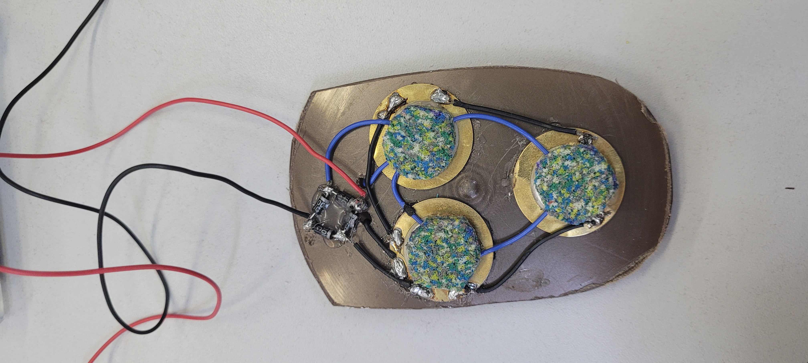

# Bolt
O Bolt é uma tornozeleira inteligente que coleta dados de uma corrida e auxilia o atleta mostrando o seu desempenho. Acompanha também uma palmilha geradora de energia.
É uma alternativa para atletas amadores e/ou de baixa renda que buscam uma solução barata para medir o seu desempenho nos seus treinos e corridas.

# Contrução
O Bolt consiste em duas partes, a tornozeleira inteligente, a qual conta com um microcontrolador ESP32 e um acelerômetro (inserir modelo do acelerometro), e a palmilha geradora de energia, a qual possui um circuito de pastilhas piezoelétricas e uma bateria recarregável.

## Tornozeleira Inteligente

## Palmilha geradora
A palmilha do Bolt possui um circuito formado por 6 pastilhas piezoelétricas ligadas em paralelo e conectadas a uma ponte de diodo, a saída desse circuito leva corrente a uma bateria recarregável a qual alimenta a tornozeleira.

# Visualização e armazenamento dos dados
Os dados coletados pelo Bolt são transmitidos para o aparelho celular do atleta via bluetooth e poderão ser vistos por meio do aplicativo do Bolt. Assim que os dados chegam no app, eles são salvos na conta do atleta por meio da API com a qual o app se comunica.

