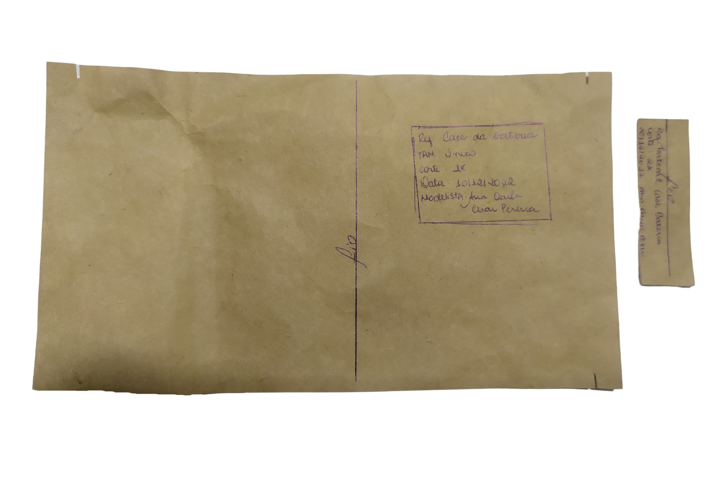

# Bolt
O Bolt é uma tornozeleira inteligente que coleta dados de uma corrida e auxilia o atleta mostrando o seu desempenho. Acompanha também uma palmilha geradora de energia.
É uma alternativa para atletas amadores e/ou de baixa renda que buscam uma solução barata para medir o seu desempenho nos seus treinos e corridas.
# Público-alvo 

Para o público-alvo decidimos focar em:

- Atletas amadores. 
- Faixa etária de 18-45 anos. 
- Pertencentes majoritariamente a classe C (renda mensal domiciliar entre R$2,9 mil e R$ 7,1 mil) e  D (renda domiciliar de até 2,9 mil ). (INFOMONEY, 2022) 

# Problema 

 A partir da escolha do público-alvo iniciamos uma pesquisa para entender quais seriam os principais problemas existentes dentro desse grupo. Com isso conseguimos identificar o seguinte problema: 

- Falta de acesso a dispositivos inteligentes acessíveis que possam gerar dados para o atleta amador conseguir gerir melhor o treino. (PISTOR, 2020) 

Complementar a isso, buscamos entender um pouco mais sobre as condições de acesso a recursos energéticos da classe D, já que o dispositivo provavelmente dependeria de uma fonte de energia para funcionar. Através de pesquisas conseguimos encontrar alguns pontos-chaves sobre a pauta: 

- *“(...)a exclusão ao acesso à energia elétrica não se dá apenas pela indisponibilidade de infraestrutura básica, mas também pela condição de se arcar com os custos associados ao seu consumo”.* (DIEESE, 2007). 

- *“A crescente procura das classes C e D por energia solar é um reflexo direto dos altos valores nas tarifas de energia elétrica nos orçamentos familiares. E essa situação é ainda mais grave para as famílias de renda mais baixa,cuja conta de energia consome uma significativa parcela da renda mensal.”* (NERIS, 2021) 

Sendo assim, com base nos dados conseguimos entender que a falta de acesso à energia limpa e acessível é uma dor latente dos indivíduos pertencentes a classe dos nosso público-alvo. Foi assim que entendemos a necessidade de implementar uma solução complementar que resolvesse o problema de acesso a energia.   

# Solução
O Bolt consiste em duas partes, a tornozeleira inteligente, a qual conta com um microcontrolador ESP32 e um acelerômetro (inserir modelo do acelerometro), e a palmilha geradora de energia, a qual possui um circuito de pastilhas piezoelétricas e uma bateria recarregável.

# Tornozeleira Inteligente

# Palmilha geradora
A palmilha do Bolt possui um circuito formado por 6 pastilhas piezoelétricas ligadas em paralelo e conectadas a uma ponte de diodo, a saída desse circuito leva corrente a uma bateria recarregável a qual alimenta a tornozeleira.

# Visualização e armazenamento dos dados
Os dados coletados pelo Bolt são transmitidos para o aparelho celular do atleta via bluetooth e poderão ser vistos por meio do aplicativo do Bolt. Assim que os dados chegam no app, eles são salvos na conta do atleta por meio da API com a qual o app se comunica.  

# Materiais e Métodos

Para o desenvolvimento do projeto da tornozeleira<b> Bolt </b>, com medição de aceleração, foi necessário a utilização do tecido Neoprene, a escolha foi devido às propriedades do tecido como impermeabilidade, proteção térmica, resistência e maleabilidade. Propriedades essas, que são essenciais para o desenvolvimento eficaz da tornozeleira, já que a mesma precisa de um revestimento impermeável e resistente, por exemplo, para proteção dos componentes elétricos internos (Ex: microcontrolador, acelerômetro). Além disso, por se tratar de um produto desenvolvido para pessoas que praticam esportes, o tecido de escolha precisa ter propriedade de regulação térmica para não prejudicar o usuário na durante o uso.(WEPICK, 2022)  

  

Para o fechamento da tornozeleira foi escolhido o velcro por possibilitar um ajuste ao tornozelo mais eficiente e se adaptar melhor a variação de tamanhos.  

  

Para o desenvolvimento da palmilha com a funcionalidade de gerar energia, foi usado uma placa de PVC para dar sustentabilidade às pastilhas  piezoelétricas e uma parte do circuito, o material foi escolhido por ter a rigidez necessária para o apoio das pastilhas mas ao mesmo tempo  ainda ter a  flexibilidade necessária para  não causar machucados ou incômodo durante o uso.  

Para revestir a placa de PVC foram cortadas 4 camadas no formato de palmilhas de tênis tamanho 42 ( sendo 2 inteiras e 2 com um corte na parte posterior para encaixar o molde de PVC) e dispostas uma sobre a outra para formar uma palmilha única com a placa de pvc interna.  

   

# Moldes 

**Pulseira da tornozeleira**

 

    

**Case da Tornozeleira** 

    

**Case da Bateria**

    

**Palmilhas**

    
 

# Precificação do Acelerômetro e Palmilha

<b>Preço ( Acelerômetro)</b> 

| Acelerômetro | Microcontrolador | Velcro | Neoprene | Fios |
|--- |--- |--- |--- |--- |
| R$ 15,00 | R$ 44,00 | R$ 1,00 |R$ 8,00 |R$ 1,00 |

- <b>Custo Bruto Total: R$ 69,00 </b>  

<b>Preço Palmilha</b>  

| Pastilhas Piezoelétricas | EVA | Chapa PVC | Powerbank | Fios |
|--- |--- |--- |--- |--- |
| R$ 6,00 | R$ 1,00 | R$ 10,00 |R$ 20,00 |R$ 1,00 |

- <b> Custo Bruto Total : R$ 38,00 </b>  

***Custo Bruto Total palmilha + tornozeleira : R$ 107,00***  

 <h3>Custo de mercado de Produtos Similares</h3> 

- Acelerômetro TGFORCE 3D - R$2.499,00 <a href="https://loja.maxrecovery.com.br/acelerometro-tgforce-3d/p">(Clique e acesse o produto)</a>  
- Garmin Smartwatch Vivoactive 4 GPS - R$ 2.118,00 <a href="https://www.amazon.com.br/Rel%C3%B3gio-Inteligente-Garmin-Vivoactive-Smartwatch/dp/B07W7W8WBH">(Clique e acesse o produto)</a>  
- Acelerometro Running Dynamics Pod Garmin Fenix 5 Plus 735XT 935 Quatix 5 - R$779,00 <a href="https://www.netshoes.com.br/acelerometro-running-dynamics-pod-garmin-fenix-5-plus-735xt-935-quatix-5-verde+cinza-412-2206-430">(Clique e acesse o produto)</a>
    

# Considerações finais

Tanto a tornozeleira quanto a palmilha precisam de ajustes e adaptações para que se tornem mais comerciais.

Pontos de melhoria:
- Case de plástico para melhor acomodação do acelerômetro  e do microcontrolador.
- Bateria deve ser menor para maior conforto do usuário final.
- Palmilha deve ser dupla e menos grossa para melhorar a usabilidade.
- Acelerômetro precisa passar por mais calibrações para obter dados mais precisos.

# Referências

- INFOMONEY. Classes D e E continuarão a ser mais da metade da população até 2024, projeta consultoria. Disponível em: https://www.infomoney.com.br/minhas-financas/classes-d-e-e-continuarao-a-ser-mais-da-metade-da-populacao-ate-2024-projeta-consultoria/. Acesso em: 10 dez. 2022. 
- PISTOR, Emily. A DESIGUALDADE DAS CONDIÇÕES SOCIOECONÔMICAS DOS ATLETAS DE ALTO RENDIMENTO DA MARCHA ATLÉTICA BRASILEIRA. 2020. 116 f. TCC (Graduação) - Curso de Curso de Graduação em Ciências Econômicas, Ufsc, Florianópolis, 2021. 
- DIEESE. As tarifas de energia elétrica no Brasil: sistemática de correção e evolução dos valores. Departamento Intersindical de estatística e estudos socioeconômicos. Nota técnica Número 58. Dez. de 2007. 
- NERIS, Alessandra. Cresce procura das classes C e D por energia solar. 2021. Disponível em: https://www.aldo.com.br/blog/cresce-procura-das-classes-c-e-d-por-energia-solar/. Acesso em: 10 dez. 2022. 
- WEPICK. Tecido Neoprene: tudo o que você precisa saber sobre. Disponível em: https://www.webpic.com.br/blog/producao/tecido-neoprene-tudo-o-que-voce-precisa-saber-sobre. Acesso em: 8 dez. 2022.
- http://repositorio.aee.edu.br/bitstream/aee/1476/1/GERAÇÃO DE ENERGIA ATRAVÉS DA PIEZOELETRECIDADE.pdf
- https://www.youtube.com/watch?v=Uc4CD1aEFwE
- https://www.instructables.com/Electricity-Generating-Footwear/
- https://razoesparaacreditar.com/tenis-gera-energia-limpa-ba/

